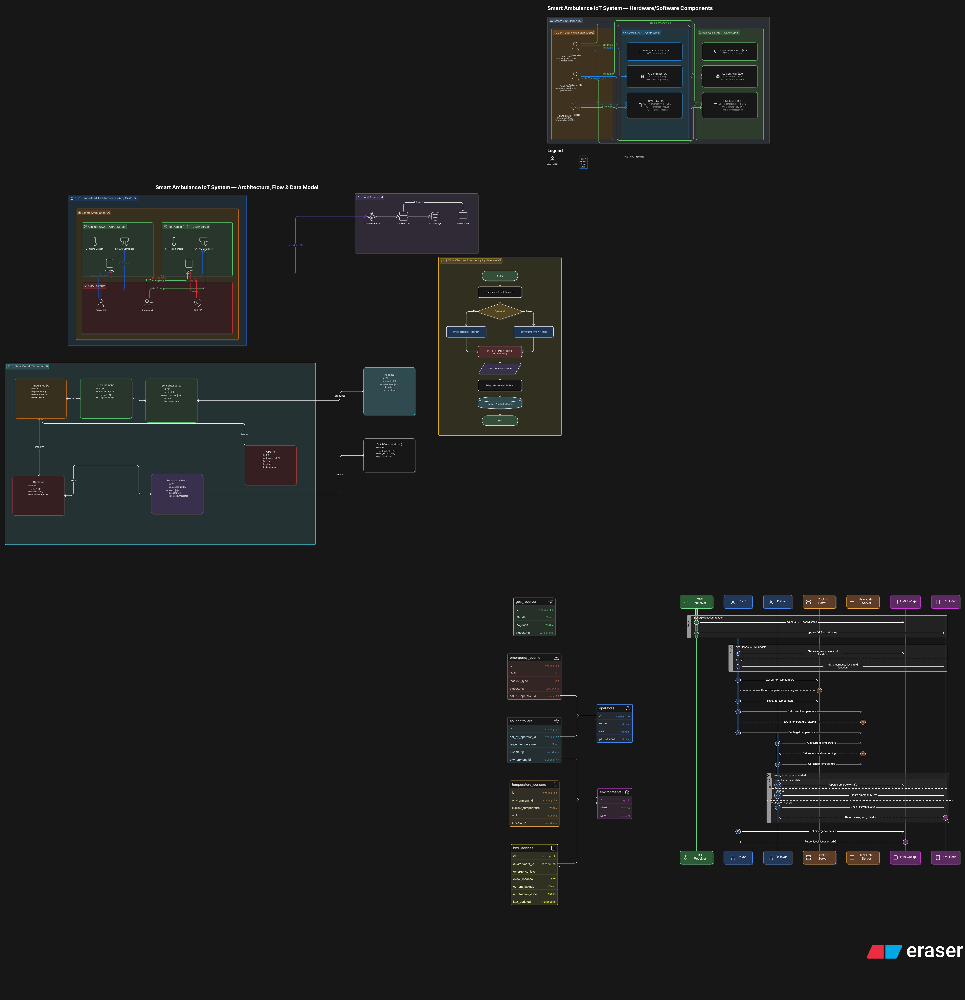

# Smart Ambulance Management System

## Overview

This project focuses on the design and simulation of a **Smart Ambulance Management System** using the **CoAP (
Constrained Application Protocol)** and the **Eclipse Californium Framework**.

The system models a smart ambulance equipped with heterogeneous virtual sensors and smart control modules operating in a
simulated environment. All communication between distributed entities is performed through CoAP clients and servers,
enabling real‑time monitoring and remote control functionalities.

---

## System Architecture

The smart ambulance, denoted as **A**, is designed for emergency response operations and contains multiple
interconnected components.

### Main Actors

| Entity | Description            | Role        |
|--------|------------------------|-------------|
| **D**  | Driver                 | CoAP Client |
| **R**  | Reliever               | CoAP Client |
| **G**  | GPS Receiver           | CoAP Client |
| **AC** | Cockpit Environment    | CoAP Server |
| **AR** | Rear Cabin Environment | CoAP Server |

---

## Functional Components

Both ambulance environments (**AC** and **AR**) host a set of CoAP resources.

### 1. Temperature Sensor (`ST`)

The temperature sensor provides the current temperature of the corresponding ambulance environment.

| Method | Description                           |
|--------|---------------------------------------|
| `GET`  | Returns the current temperature value |

* The returned temperature may vary according to the state of the air conditioning system.

### 2. Air Conditioning Controller (`SA`)

The air conditioning controller manages the target temperature inside the ambulance environments.

| Method | Description                                         |
|--------|-----------------------------------------------------|
| `GET`  | Returns the currently configured target temperature |
| `PUT`  | Updates the target temperature                      |

**Access Control Rules**

| Operator     | AC (Cockpit)  | AR (Rear Cabin) |
|--------------|---------------|-----------------|
| Driver (D)   | ✅ Allowed     | ✅ Allowed       |
| Reliever (R) | ❌ Not Allowed | ✅ Allowed       |

### 3. Human Machine Interface (`SH`)

The Human Machine Interface represents a smart tablet/dashboard used by operators.

| Method | Description                                                  |
|--------|--------------------------------------------------------------|
| `GET`  | Returns emergency level, event location, and GPS coordinates |
| `PUT`  | Updates emergency level and event location                   |

**Emergency Levels**

| Value | Meaning |
|-------|---------|
| `1`   | Low     |
| `2`   | Medium  |
| `3`   | High    |

**Event Locations**

| Value | Meaning      |
|-------|--------------|
| `1`   | Street       |
| `2`   | Workplace    |
| `3`   | Public Space |
| `4`   | Home         |

---

## GPS Integration

The GPS receiver (**G**) continuously tracks the ambulance position and updates both HMIs with latitude and longitude.

**GPS Permissions**

| Entity           | Permission                       |
|------------------|----------------------------------|
| GPS Receiver (G) | Can update GPS coordinates only  |
| Driver (D)       | Can update emergency information |
| Reliever (R)     | Can update emergency information |

---

## Synchronization Constraints

To ensure consistency across the system:

* Updates performed by **D** or **R** on emergency level and event location **must be applied simultaneously** on:
    * `SH` in `AC`
    * `SH` in `AR`
* GPS updates from **G** must also synchronize both HMIs.

---

## Communication Model

The project relies on the **CoAP protocol** for lightweight machine‑to‑machine communication.

| Technology              | Purpose                            |
|-------------------------|------------------------------------|
| **CoAP**                | Lightweight communication protocol |
| **Eclipse Californium** | Java framework for CoAP            |
| **Java**                | System implementation              |
| **Virtual Sensors**     | Environment simulation             |

---

## Documentation

Detailed technical documentation for each component is available in the `docs/` folder.

| Document                                   | Description                                                                                  |
|--------------------------------------------|----------------------------------------------------------------------------------------------|
| [Requirements](docs/requirements.doc.md)   | Original project requirements and specifications                                             |
| [Enums](docs/enum.doc.md)                  | All enums used in the project: `ServerState`, `CabinType`, `EmergencyLevel`, `EventLocation` |
| [Client Base Class](docs/client.doc.md)    | Abstract `Client` class – CoAP communication core                                            |
| [Role Clients](docs/coap.clinet.doc.md)    | Concrete role clients: `DriverClient`, `RelieverClient`, `GpsClient`                         |
| [Coordinators](docs/coordinator.doc.md)    | High‑level orchestrators for driver, reliever, and GPS operations                            |
| [Resources](docs/resources.doc.md)         | CoAP resource implementations: temperature sensor, AC, HMI                                   |
| [Server](docs/server.doc.md)               | `BaseAmbulanceServer`, `CockpitServer`, `RearCabinServer`                                    |
| [CoAP API Testing](docs/coap_endpoints.md) | Endpoint reference and test commands (if present)                                            |

The architecture diagram is also available:


# Application.java – Main Entry Point & Simulation Orchestrator

## Overview

`Application` is the single entry point for the **Smart Ambulance CoAP Simulation**.  
It starts the two cabin CoAP servers (Cockpit and Rear Cabin) once, then presents an interactive coloured menu that
allows the user to:

- **Run an automatic demonstration** – a 5‑phase emergency scenario that exercises all roles, resources, and access
  controls.
- **Enter manual mode** – an interactive CoAP request builder that lets the user send `GET`/`PUT` requests to any
  resource (temperature, air‑conditioning, HMI) with custom payloads.
- **Exit** the application.

All terminal output is enhanced with **Jansi** for colour‑coded role tags, section headers, success/error messages, and
formatted JSON responses (via `JsonCliRenderer`).

**Location:** `com.ambulance.app.Application`

---

## Responsibilities

- Initialise Jansi console colours.
- Create and start both `CockpitServer` and `RearCabinServer` once.
- Display a main menu loop (`1 = auto`, `2 = manual`, `0 = exit`) and delegate to the appropriate mode.
- In **automatic mode**, run a pre‑scripted sequence of CoAP requests using the three coordinators (`DriverCoordinator`,
  `RelieverCoordinator`, `GpsCoordinator`), simulating a realistic emergency response.
- In **manual mode**, provide a sub‑menu for selecting a cabin, resource, and operation, then build and send a CoAP
  request and display the coloured JSON response.
- Handle input errors gracefully and loop back to menus until the user chooses to exit.

---

## Usage

### Start the Application

The project includes a convenience shell script `run.sh` that cleans, compiles, and launches the application:

```bash
./run.sh